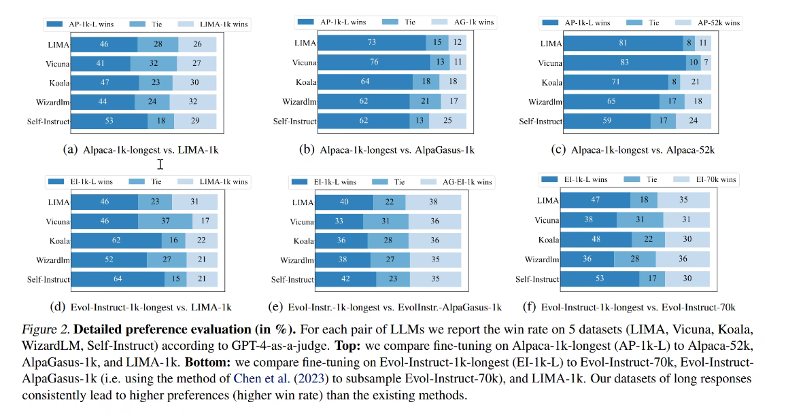

## LLAMA-Factory使用

1. 路径：/home/hxx/LLAMA-Factory

2. 基本步骤

（1）先注册数据（data）

（2）再改脚本（bash）（全量）

（3）配置文件（example），一般是全量微调

> PS: 跑实验的配置文件路径是docker内的路径，不要混了

## 模型评估（刘聪）

两个模型跑完，出对比结果（数据+图表），写通用的代码体系

输入：两个模型，一个评测集

输出：一个分数的对比表单

## ddl

时间点：最好周二汇报初步结果,最迟周三