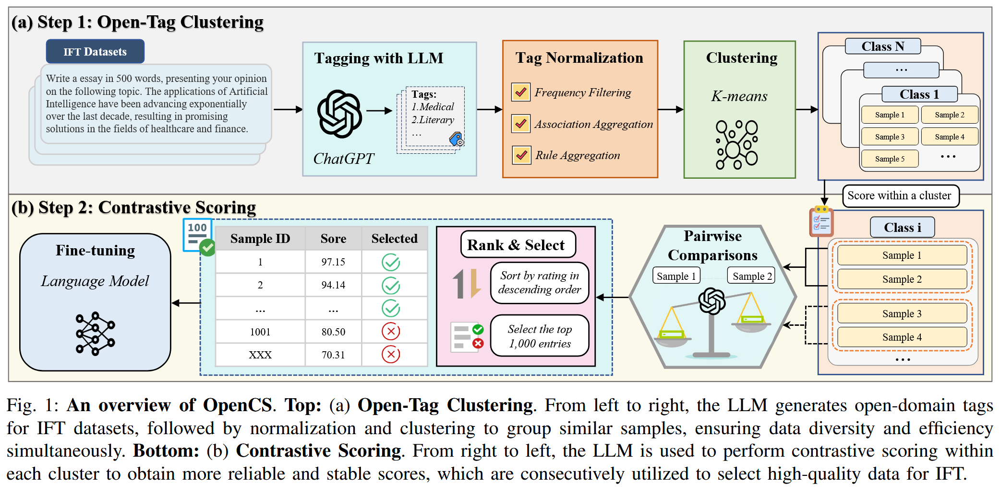
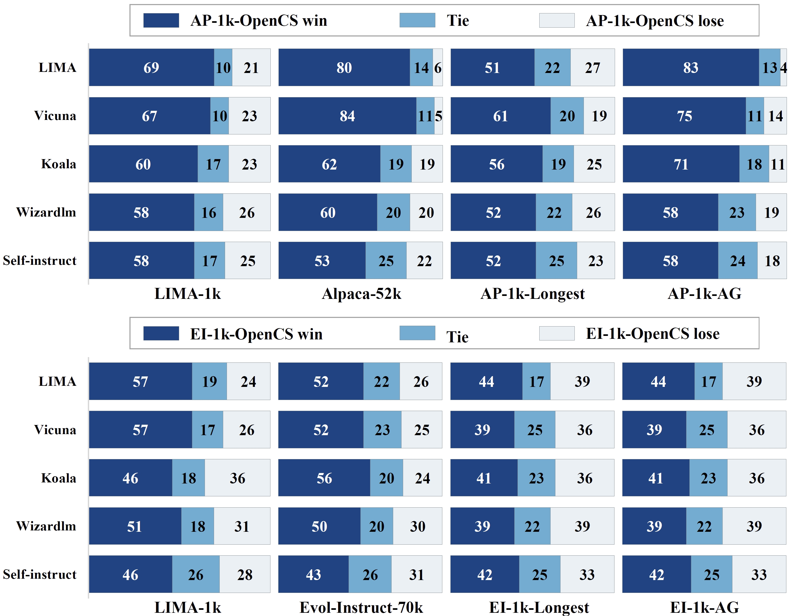
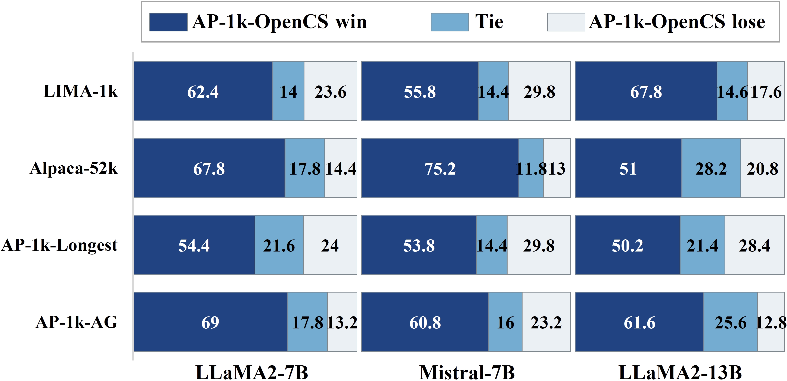
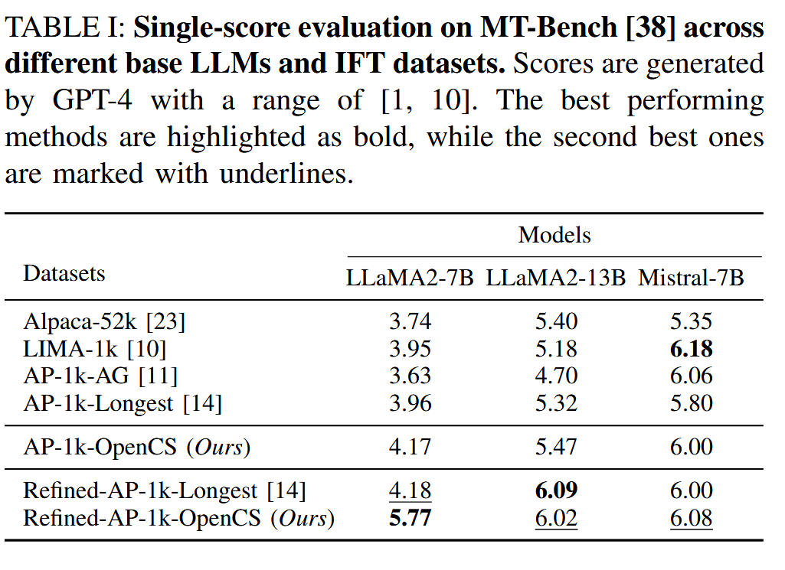

# <h1 align="center">OpenCS: Open-Tag Clustering and Contrastive Scoring for Instruction Fine-Tuning Data Selection</h1>

<div align="center">
    
</div>

This project introduces OpenCS, a novel method for Instruction Fine-Tuning (IFT) of large language models (LLMs). OpenCS enhances data selection through Open-tag clustering and Contrastive Scoring, improving data diversity and stability. Our experiments demonstrate that OpenCS significantly outperforms existing methods, achieving superior instruction-following performance on MT-Bench.

<a href="https://github.com/hexixiang">Xixiang He</a>, <a href="https://github.com/haoyu94">Hao Yu</a>, <a href="https://github.com/Antiman-cmyk">Qiyao Sun</a>, <a href="https://github.com/JohnTeller722">Tailai Zhang</a>, <a href="https://github.com/liangren-danggui">Cong Liu</a>, <a href="https://github.com/GUOShuxuan">Shuxuan Guo</a>


This repository contains:

- The code for selecting and filtering the data.
- The curated dataset used for instruction fine-tuning.
- The scripts for fine-tuning the model.
- The evaluation scripts to assess model performance.
- Results from model inference and evaluations.
- Scoring and pairwise comparison prompts.
- The code for model inference.

Note: thanks to the community for providing useful feedbacks, which really stimulates us to a better open-source.

## :rocket: ToDo
- [X] Release the code
- [X] Release the data
- [ ] Release the instruction fine-tuned models

## Install 
Before setting up the training code, install the required packages listed in `requirements.txt`. Run the following command:

```bash
pip install -r requiments.txt
```

Next, the training code is primarily dependent on the <a href="https://github.com/hiyouga/LLaMA-Factory">LLaMA-Factory</a> platform. So we install the required packages via running.

```bash
cd train
pip install -e ".[torch,metrics]"
```

Optional additional dependencies include: torch、torch-npu、metrics、deepspeed、liger-kernel、bitsandbytes、hqq、eetq、gptq、awq、aqlm、vllm、galore、badam、adam-mini、qwen、modelscope、quality

> [!TIP]
> If you encounter package conflicts, you can resolve them by using `pip install --no-deps -e .` .

## Data Release

- `data/alpaca/filtered_alpaca_1k_opencs.json` is the top 1k selected data, filtered from 52k instruction-following data of Alpaca through a process of open-tag clustering followed by contrastive scoring. This dataset is curated to maximize diversity and ensure high-quality data selection for IFT.
- `data/alpaca/refined_alpaca_1k_opencs.json` is the refined version of `filtered_alpaca_1k_opencs.json`, where we use ChatGPT to further enhance the quality and coherence of the data, resulting in a final set of 1k refined examples.
- `data/evol-instruct/filtered_evol_instruct_1k_opencs` is a dataset of 1k high-quality examples, selected from the evol-instruct 70k dataset using the same data selection method to ensure data diversity and quality for IFT.
- `data/ablation_data/alpaca_1k_opencs_wo_contrastive_score.json` is the dataset used for ablation studies, where data was selected solely based on open-tag clustering without using contrastive scoring. Instead, individual scoring was applied to validate the effectiveness of our contrastive scoring module.
- `data/ablation_data/alpaca_1k_opencs_wo_open_tag_cluster.json` is the dataset used for ablation studies to validate the effectiveness of the open-tag clustering. The top 1k examples were selected solely through contrastive scoring from the entire dataset, without using the open-tag clustering method.

## Open-Tag Clustering and Contrastive Scoring
### Open-tag Clustering

This project utilizes Open-tag Clustering to enhance data diversity by generating, clustering, and processing tags for human queries. The clustering process groups similar tags together, which allows for more efficient and representative data selection. The use of Open-tag Clustering significantly contributes to the improved performance of our Instruction Fine-Tuning (IFT) model.

For detailed instructions on how to run the Open-tag Clustering scripts, please refer to the [Open-tag Clustering README](src/open_tag_clustering/readme.md).

#### Tag Generation using ChatGPT
We use ChatGPT to automatically generate open-domain tags for each query in the dataset. This ensures that the tags reflect the diversity of the underlying instructions and captures a broad range of topics.

<div align="center">
    
</div>

*Figure: Tag cloud representing the distribution of generated tags.*

#### Tag Space Compression using Normalization

After generating and clustering tags, we apply a normalization process to denoise and further refine the clusters, ensuring that the final selection maintains diversity without redundancy. Below is a comparison showing the difference between the raw tags and the normalized tags after regularization.

<div align="center">
    
</div>

*Figure: Distribution of Tags before and after Normalization. The introduced normalization procedures compress the size of the original tag set from around 50k to less than 6k.*


### Contrastive Scoring

For detailed instructions on how to run the Open-tag Clustering scripts, please refer to the [Contrastive Scoring README](src/contrastive_score/readme.md).


## Model Fine-Tuning

The scripts for fine-tuning the models are provided in the `train/bash/sft_full.sh` file. This script allows you to fine-tune different open-sourced models like Llama2-7b, Llama2-13b, and Mistral-7b-v0.1 used in the experiments.

- To do instruction fine-tuning on the LLM, run the following command inside `train`:
```bash
cd train
wandb login
sh bash/sft_full.sh
```
For each model, the corresponding training parameters can be found in the following YAML files located in the `train/examples/train_full` directory:

- `llama2-13b_full_sft_ds3.yaml`
- `llama2-7b_full_sft_ds3.yaml`
- `mistral-7b_full_sft_ds3.yaml`

These configuration files contain all necessary hyperparameters, batch sizes, and other specific settings for each model. 

If you want to fine-tune all models in one go, we provide a Python script located at `train/train.py`. By simply running this script, you can initiate the fine-tuning process for all the models mentioned above.

```bash
python train/train.py
```

## Generate Model Answer

After fine-tuning the models, you can generate answers using the inference scripts. The script for model inference is located in the `infer/fastchat/llm_judge/gen_answer.sh` file. This script allows you to generate answers from the trained models.

To run the inference and generate answers, navigate to the `infer/fastchat/llm_judge` directory and execute the following command:

```bash
cd infer/fastchat/llm_judge
sh gen_answer.sh
```

## Evaluation

We conducted a preference evaluation to compare the performance of OpenCS against several baseline methods. The evaluation was carried out on two datasets: Alpaca52k and Evol-Instruct-70k, using the LLaMA2-7B model.

The preference evaluation results, shown below, demonstrate the win, tie, and lose rates of OpenCS compared to the baseline methods. The rows represent the five test sets used in the evaluation, while the columns correspond to the four baseline methods.

### Preference Evaluation Results (in %)

The results clearly show that OpenCS consistently achieves higher preference scores compared to the existing methods across both datasets.

<div align="center">
    
</div>

*Figure: Preference evaluation results on Alpaca52k and Evol-Instruct-70k datasets with LLaMA2-7B.*

### Model Evaluation Script

To perform a detailed evaluation using GPT-4 for pairwise comparison of model answers, we provide a script located at `evaluate/evaluation_gpt4.py`. This script allows you to compare the responses of two models, assessing their quality based on various criteria.

### Usage

1. **Prepare Your Input**: Ensure your input JSON files contain prompts and the answers from both models you wish to compare.

2. **Run the Evaluation Script**: Execute the script with the following command:

    ```bash
    python evaluate/evaluation_gpt4.py --input_dir /path/to/input --output_dir /path/to/output --key_1 model_name1 --key_2 model_name2
    ```

   Make sure to replace `/path/to/input` with the directory of your JSON files, `/path/to/output` with where you want to save results, and `model_name1` and `model_name2` with the respective model names.

3. **Results**: The results will be saved in the specified output directory, including scores and reviews for each answer pair evaluated by GPT-4.

This evaluation process provides valuable insights into the relative performance of different models, helping to highlight strengths and areas for improvement.

<!-- 
### Cross-LLM performance (in %)

<div align="center">
    
</div> -->

### MT-Bench

We conducted a single-score evaluation on MT-Bench across different base LLMs and IFT datasets. Scores were generated by GPT-4 on a scale ranging from [1, 10]. The results highlight the effectiveness of our approach, with the best performing methods bolded and the second best methods underlined.

The following table summarizes the scores obtained by OpenCS compared to other baseline methods on various datasets. These results demonstrate that OpenCS consistently achieves high scores, affirming its superiority in instruction-following tasks.

<div align="center">
    
</div>

*Figure: Single-score evaluation results on MT-Bench for various LLMs.*


## References
- [Koala](https://github.com/young-geng/EasyLM/tree/main)
- [Vicuna](https://vicuna.lmsys.org/)
- [Lima](https://arxiv.org/abs/2305.11206)
- [Alpaca](https://github.com/tatsu-lab/stanford_alpaca)
- [Evol-Instruct](https://github.com/nlpxucan/WizardLM)
- [long](https://github.com/tml-epfl/long-is-more-for-alignment)
- [GPT-4-Report](https://arxiv.org/pdf/2303.08774.pdf)